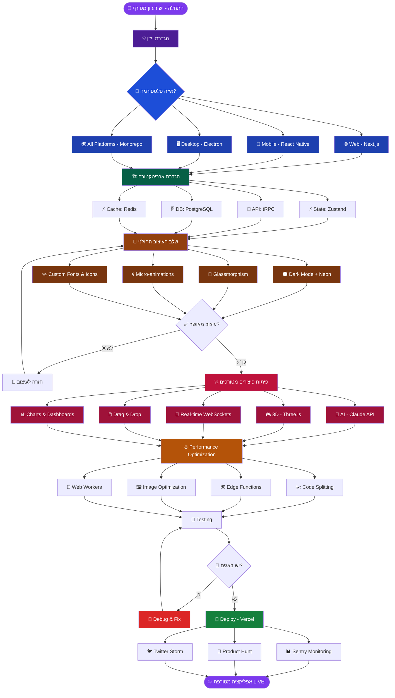

# תרשים זרימה — איך לבנות אפליקציה מטורפת

```mermaid
flowchart TD
    A([🚀 התחלה - יש רעיון מטורף]) --> B[💡 הגדרת ויז'ן]
    B --> C{🤔 איזה פלטפורמה?}

    C --> D[🌐 Web - Next.js]
    C --> E[📱 Mobile - React Native]
    C --> F[🖥️ Desktop - Electron]
    C --> G[🌍 All Platforms - Monorepo]

    D & E & F & G --> H[🏗️ הגדרת ארכיטקטורה]

    H --> I1[⚡ State: Zustand]
    H --> I2[🔄 API: tRPC]
    H --> I3[🗄️ DB: PostgreSQL]
    H --> I4[⚡ Cache: Redis]

    I1 & I2 & I3 & I4 --> J[🎨 שלב העיצוב החולני]

    J --> K1[🌑 Dark Mode + Neon]
    J --> K2[💎 Glassmorphism]
    J --> K3[🌀 Micro-animations]
    J --> K4[✏️ Custom Fonts & Icons]

    K1 & K2 & K3 & K4 --> L{✅ עיצוב מאושר?}

    L --> |❌ לא| M[🔁 חזרה לעיצוב]
    M --> J

    L --> |✅ כן| N[💥 פיתוח פיצ'רים מטורפים]

    N --> O1[🤖 AI - Claude API]
    N --> O2[🎮 3D - Three.js]
    N --> O3[📡 Real-time WebSockets]
    N --> O4[🖱️ Drag & Drop]
    N --> O5[📊 Charts & Dashboards]

    O1 & O2 & O3 & O4 & O5 --> P[🔥 Performance Optimization]

    P --> Q1[✂️ Code Splitting]
    P --> Q2[🌍 Edge Functions]
    P --> Q3[🖼️ Image Optimization]
    P --> Q4[👷 Web Workers]

    Q1 & Q2 & Q3 & Q4 --> R[🧪 Testing]

    R --> S{🐛 יש באגים?}
    S --> |כן| T[🔧 Debug & Fix]
    T --> R
    S --> |לא| U[🚀 Deploy - Vercel]

    U --> V1[📊 Sentry Monitoring]
    U --> V2[📣 Product Hunt]
    U --> V3[🐦 Twitter Storm]

    V1 & V2 & V3 --> W([💥 אפליקציה מטורפת LIVE!])

    style A fill:#7c3aed,color:#fff
    style W fill:#7c3aed,color:#fff
    style B fill:#4c1d95,color:#fff
    style C fill:#1d4ed8,color:#fff
    style D fill:#1e40af,color:#fff
    style E fill:#1e40af,color:#fff
    style F fill:#1e40af,color:#fff
    style G fill:#1e40af,color:#fff
    style H fill:#065f46,color:#fff
    style J fill:#92400e,color:#fff
    style K1 fill:#78350f,color:#fff
    style K2 fill:#78350f,color:#fff
    style K3 fill:#78350f,color:#fff
    style K4 fill:#78350f,color:#fff
    style N fill:#be123c,color:#fff
    style O1 fill:#9f1239,color:#fff
    style O2 fill:#9f1239,color:#fff
    style O3 fill:#9f1239,color:#fff
    style O4 fill:#9f1239,color:#fff
    style O5 fill:#9f1239,color:#fff
    style P fill:#b45309,color:#fff
    style T fill:#dc2626,color:#fff
    style U fill:#15803d,color:#fff
```
